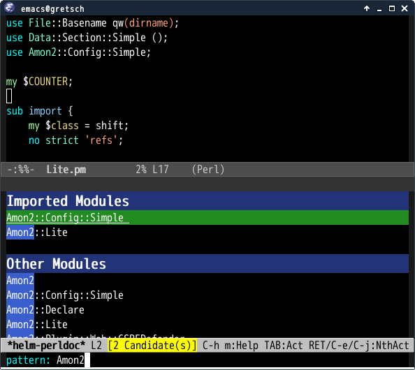

# helm-perldoc.el [![travis badge][travis-badge]][travis-link] [![melpa badge][melpa-badge]][melpa-link] [![melpa stable badge][melpa-stable-badge]][melpa-stable-link]




## Introduction
`helm-perldoc.el` is `perldoc`, Perl documentation command, with helm interface.


## Requirements

* Emacs 24 or higher
* helm 1.7.7 or higher
* [deferred.el](https://github.com/kiwanami/emacs-deferred)
* Perl


## Installation

`helm-perldoc` is available on [MELPA](https://melpa.org/) and [MELPA stable](https://stable.melpa.org/)

You can install `helm-perldoc` with the following command.

<kbd>M-x package-install [RET] helm-perldoc [RET]</kbd>


## Basic Usage

#### `helm-perldoc`

Search module and do action.

#### `helm-perldoc:setup`

Update module list for viewing documenations.

#### `helm-perldoc:carton-setup`

Update module list based [Carton](https://github.com/miyagawa/carton).
Local library path is decided on `helm-perldoc:default-carton-path`.

#### `helm-perldoc:history`

Search modules which is already searched

## Customize

#### `helm-perldoc:perl5lib`

`PERL5LIB` envirnoment variable which is set when `perl` and `perldoc`
commands are executed.

#### `helm-perldoc:default-carton-path`(Default `local/lib/perl5`)

Default carton library path.


## Actions

* View Document
* View Source code
* Insert import statement
* Check with `corelist`


## Setup

```lisp
;; helm-perldoc:setup takes long time on low power platform
(eval-after-load "cperl-mode"
  '(progn
    (helm-perldoc:setup)))

;; auto carton setup
(add-hook 'cperl-mode-hook 'helm-perldoc:carton-setup)
```

[travis-badge]: https://travis-ci.org/syohex/emacs-helm-perldoc.svg
[travis-link]: https://travis-ci.org/syohex/emacs-helm-perldoc
[melpa-link]: https://melpa.org/#/helm-perldoc
[melpa-stable-link]: https://stable.melpa.org/#/helm-perldoc
[melpa-badge]: https://melpa.org/packages/helm-perldoc-badge.svg
[melpa-stable-badge]: https://stable.melpa.org/packages/helm-perldoc-badge.svg
